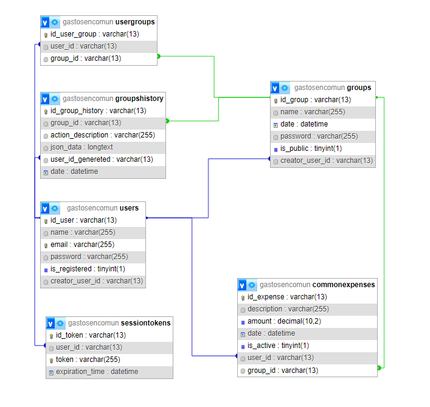

# Gastos Compartidos App

## Descripción

La aplicación de Gastos Compartidos permite a los usuarios llevar un registro de sus gastos compartidos y calcular las deudas entre ellos.

## Funcionalidades

1. **Registro de Usuario:**

   - Los usuarios pueden crear cuentas para comenzar a registrar sus gastos.

2. **Registro de Gastos:**

   - Los usuarios pueden ingresar los gastos individuales, especificando la cantidad y la categoría.

3. **Visualización de Gastos:**

   - Los usuarios pueden ver un resumen de sus gastos individuales y totales.

4. **Cálculo de Deudas:**

   - La aplicación calculará automáticamente las deudas entre los usuarios basándose en los gastos registrados.

5. **Ajuste de Cuentas:**

   - Los usuarios pueden realizar ajustes de cuentas para liquidar las deudas.

6. **Soporte para Grupos:**

   - La aplicación permite a los usuarios unirse a grupos compartidos (por ejemplo, amigos en una reunión) y registrar gastos grupales.

7. **Visualización de Historial:**
   - Los usuarios pueden ver un historial de gastos y ajustes de cuentas anteriores.

## Diagrama de Base de Datos

## Instalación y Ejecución

1. Clona este repositorio.
2. Configura el backend y el frontend según las instrucciones en sus respectivos directorios.

## Tecnologías Utilizadas

- Backend: PHP con paradigma POO y MySQL.
- Frontend: React.

## Contribuciones

¡Contribuciones son bienvenidas! Por favor, abre un problema (issue) antes de enviar un pull request.
